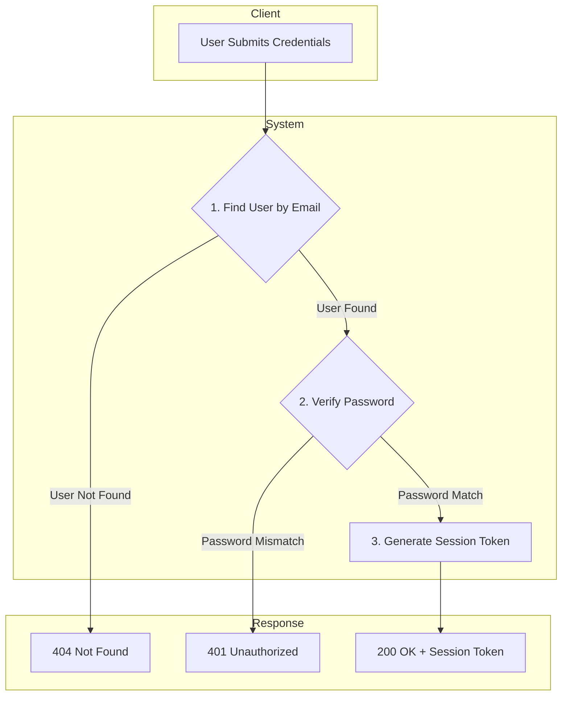
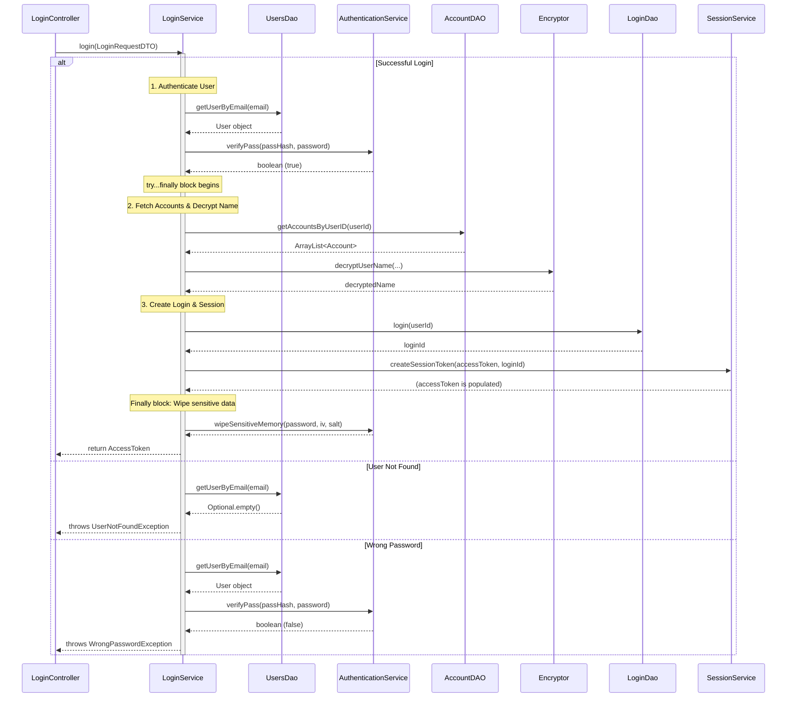
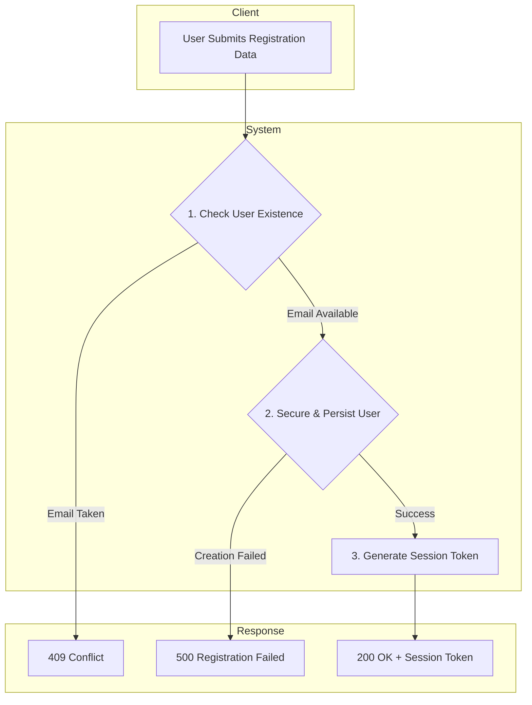
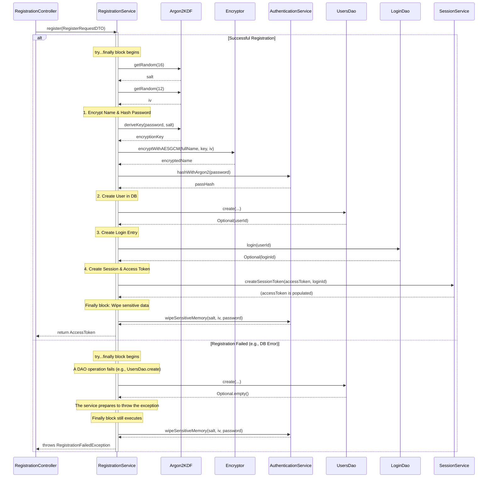
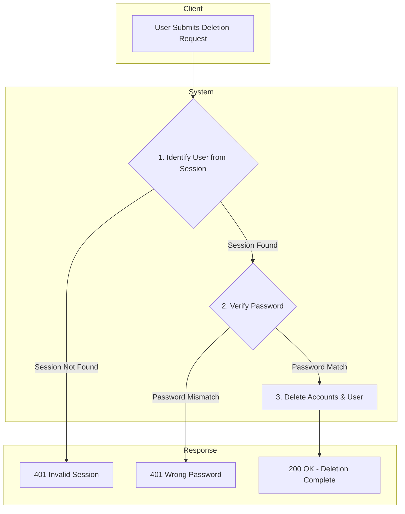
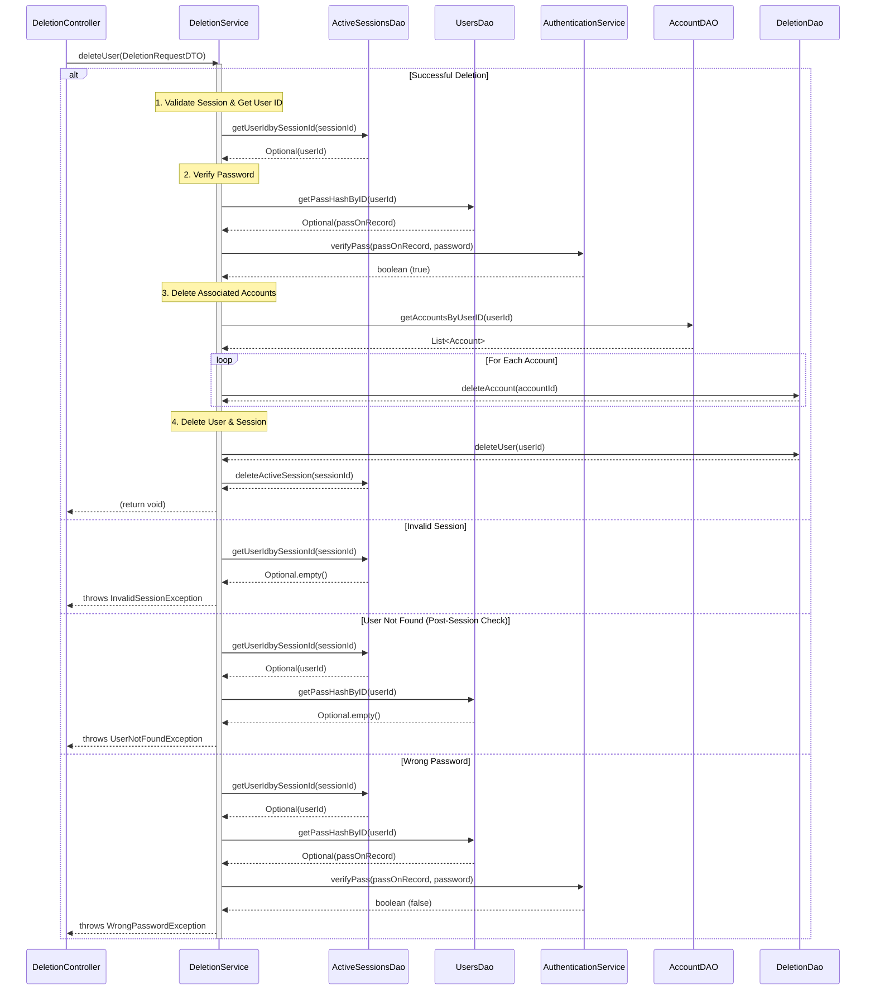
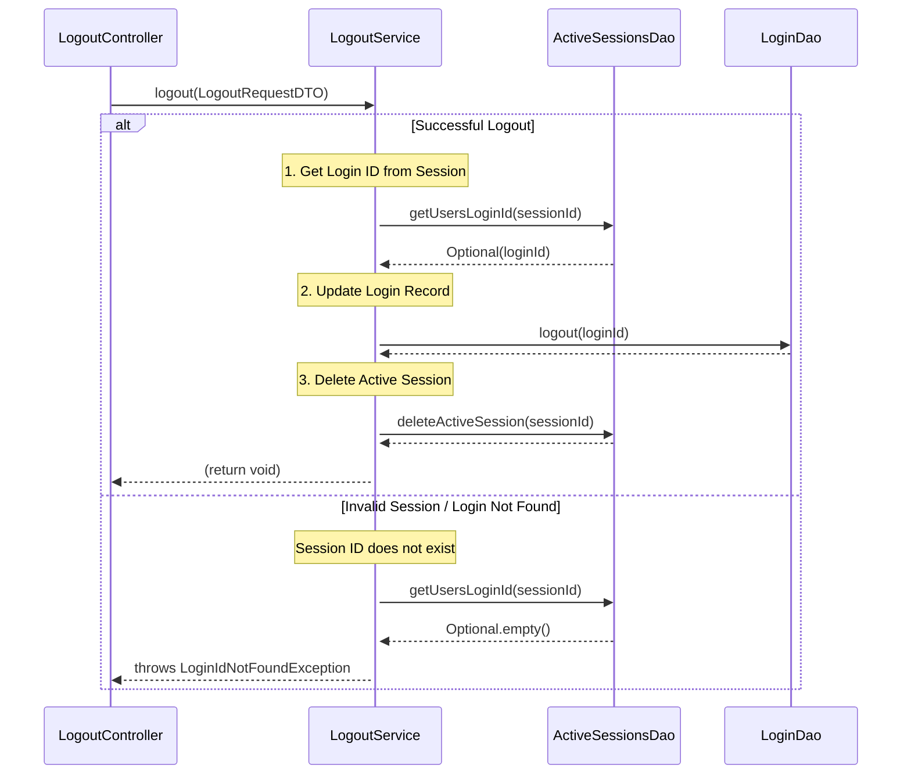
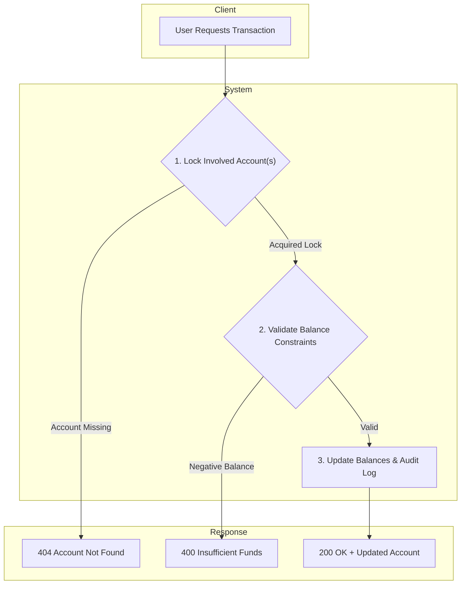
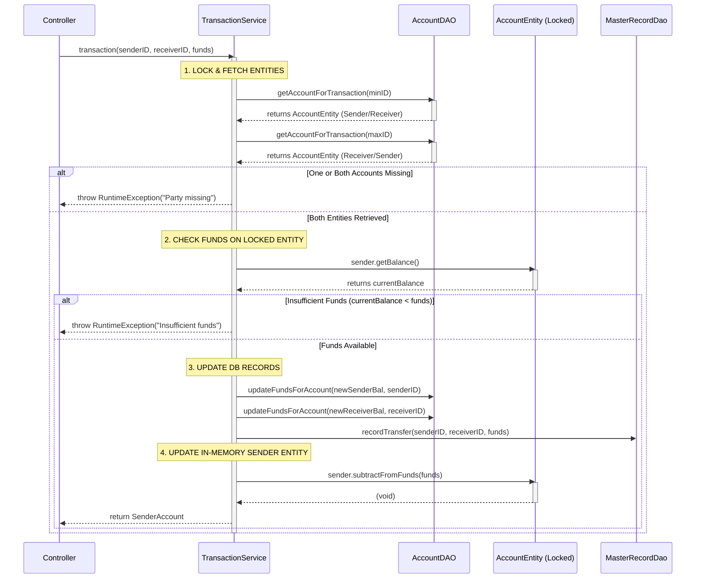

# Architecture:
This file holds flow charts and sequence diagrams for the mos important logic chains.

## Ledger:
1. [Login](#login-chain)
2. [Register](#registration-chain)
3. [Deletion](#deletion-chain)
4. [Transaction](#transaction-chain)

## Login chain:
[Back to Ledger](#ledger)
### Abstract :

### Implementation:

## Registration chain
[Back to Ledger](#ledger)
### Abstract:

### Implementation:

## Deletion chain:
[Back to Ledger](#ledger)
### Abstract:

### Implementation:

## Logout chain:

### Implementation:

## Transaction chain:
[Back to Ledger](#ledger)
### Abstract:

### Implementation:

