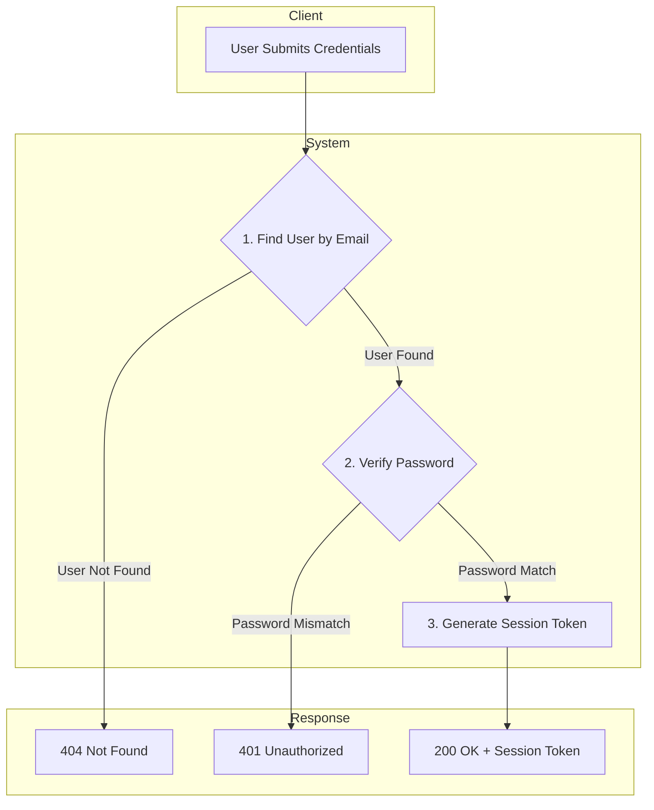
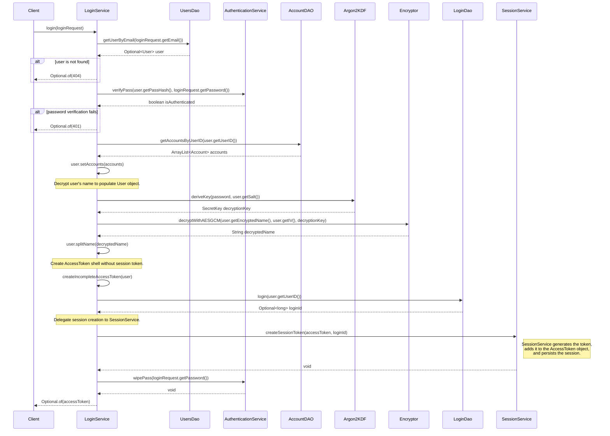

# Architecture:

## Login chain:

### Abstract :

```mermaid

graph TD
    subgraph Client
        A[User Submits Credentials]
    end

    subgraph System
        B{1. Find User by Email}
        C{2. Verify Password}
        D[3. Generate Session Token]
    end

    subgraph Response
        E[404 Not Found]
        F[401 Unauthorized]
        G[200 OK + Session Token]
    end

    A --> B
    B -- User Not Found --> E
    B -- User Found --> C
    C -- Password Mismatch --> F
    C -- Password Match --> D
    D --> G
```

### Implementation:

```mermaid
sequenceDiagram
    participant Client
    participant LoginService
    participant UsersDao
    participant AuthenticationService
    participant AccountDAO
    participant Argon2KDF
    participant Encryptor
    participant LoginDao
    participant SessionService

    Client->>LoginService: login(loginRequest)
    LoginService->>UsersDao: getUserByEmail(loginRequest.getEmail())
    UsersDao-->>LoginService: Optional<User> user

    alt user is not found
        LoginService-->>Client: Optional.of(404)
    end

    LoginService->>AuthenticationService: verifyPass(user.getPassHash(), loginRequest.getPassword())
    AuthenticationService-->>LoginService: boolean isAuthenticated

    alt password verification fails
        LoginService-->>Client: Optional.of(401)
    end

    LoginService->>AccountDAO: getAccountsByUserID(user.getUserID())
    AccountDAO-->>LoginService: ArrayList<Account> accounts
    LoginService->>LoginService: user.setAccounts(accounts)

    Note over LoginService: Decrypt user's name to populate User object.
    LoginService->>Argon2KDF: deriveKey(password, user.getSalt())
    Argon2KDF-->>LoginService: SecretKey decryptionKey
    LoginService->>Encryptor: decryptWithAESGCM(user.getEncryptedName(), user.getIV(), decryptionKey)
    Encryptor-->>LoginService: String decryptedName
    LoginService->>LoginService: user.splitName(decryptedName)

    Note over LoginService: Create AccessToken shell without session token.
    LoginService->>LoginService: createIncompleteAccessToken(user)

    LoginService->>LoginDao: login(user.getUserID())
    LoginDao-->>LoginService: Optional<long> loginId

    Note over LoginService: Delegate session creation to SessionService.
    LoginService->>SessionService: createSessionToken(accessToken, loginId)
    Note right of SessionService: SessionService generates the token,<br/>adds it to the AccessToken object,<br/>and persists the session.
    SessionService-->>LoginService: void

    LoginService->>AuthenticationService: wipePass(loginRequest.getPassword())
    AuthenticationService-->>LoginService: void

    LoginService-->>Client: Optional.of(accessToken)
```
